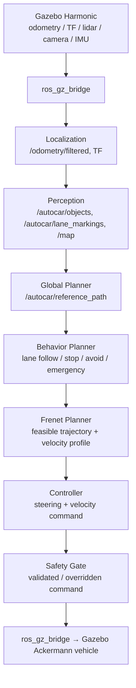

<p align="center">
  <h1 align="center">DriveSim</h1>
</p>

<p align="center">
  <strong>Autonomous vehicle simulation for Ubuntu 24.04, ROS 2 Jazzy, and Gazebo Harmonic</strong>
</p>

<p align="center">
  
  
  
  
</p>

---

## Overview

**DriveSim** is a ROS 2-based autonomous vehicle simulation framework. The vehicle follows a circular road using a Stanley lateral controller, cubic-spline path interpolation, and a Bayesian occupancy filter for mapping. An interactive mode lets users place waypoints in RViz.

The project is derived from [AutoCarROS](https://github.com/winstxnhdw/AutoCarROS) and has been fully migrated to **Ubuntu 24.04 LTS**, **ROS 2 Jazzy Jalisco**, and **Gazebo Harmonic (gz-sim 8.x)**.

---

## Target Environment

| Component | Version |
|---|---|
| OS | Ubuntu 24.04 LTS |
| ROS 2 | Jazzy Jalisco |
| Gazebo | Harmonic (gz-sim 8.x) |
| Python | 3.12 |
| Build tool | colcon |

---

## Repository Structure

```text
DriveSim/
src/
  launches/              # ROS 2 launch files (default_launch.py, click_launch.py)
  autocar_description/   # URDF/Xacro robot description and RViz config
  autocar_gazebo/        # Gazebo Harmonic worlds, SDF model, meshes
  autocar_common/        # Shared frame names and vehicle parameters
  autocar_localization/  # robot_localization EKF configuration
  autocar_perception/    # Lightweight lidar obstacle perception
  autocar_planning/      # Frenet trajectory planner and helpers
  autocar_safety/        # Safety gate between controller and vehicle command
  autocar_map/           # Bayesian occupancy filter (C++ node)
  autocar_msgs/          # Custom ROS 2 messages (paths, state, objects, trajectories)
  autocar_nav/           # Navigation stack (Python nodes + spline library)
```

---

## System Dependencies

### 1. ROS 2 Jazzy

```bash
# Follow https://docs.ros.org/en/jazzy/Installation.html
sudo apt install ros-jazzy-desktop
source /opt/ros/jazzy/setup.bash
```

### 2. Gazebo Harmonic + ROS bridge

```bash
sudo apt install ros-jazzy-ros-gz
```

This installs `ros_gz_sim`, `ros_gz_bridge`, and Gazebo Harmonic (gz-sim 8.x).

### 3. Build tools and Python deps

```bash
sudo apt install python3-colcon-common-extensions python3-rosdep
sudo apt install python3-numpy ros-jazzy-xacro ros-jazzy-robot-state-publisher ros-jazzy-rviz2
sudo apt install ros-jazzy-robot-localization
pip3 install pandas  # required by globalplanner.py
```

---

## Build

```bash
cd /path/to/DriveSim   # e.g., ~/Desktop/DriveSim

# Install ROS package dependencies
source /opt/ros/jazzy/setup.bash
rosdep update
rosdep install --from-paths src --ignore-src -r -y

# Build
colcon build

# Source
source install/setup.bash
```

### Verify packages are found

```bash
ros2 pkg list | grep autocar
# Expected output:
# autocar_common
# autocar_description
# autocar_gazebo
# autocar_localization
# autocar_map
# autocar_msgs
# autocar_nav
# autocar_perception
# autocar_planning
# autocar_safety
```

---

## Usage

Always source both ROS 2 and the workspace before launching:

```bash
source /opt/ros/jazzy/setup.bash
source install/setup.bash
```

### Default simulation (preset waypoint loop)

Starts the vehicle on a circular road. It follows pre-recorded waypoints autonomously using the global planner and Stanley controller.

```bash
ros2 launch launches default_launch.py
```

### Interactive simulation (click-to-navigate)

Place at least 2 waypoints using **RViz's "2D Goal Pose"** tool. The vehicle will follow a cubic spline through them.

```bash
ros2 launch launches click_launch.py
```

### Optional: select a different world

```bash
ros2 launch launches default_launch.py world:=autocar_city.world
```

---

## Architecture

DriveSim is organized as a layered autonomous-driving stack. The current repository implements the minimal loop needed for waypoint following and lidar-based mapping, while the architecture below defines a clean extension path for more realistic perception, planning, control, and safety.

```text
Sensors -> Localization -> Perception -> Planning -> Control -> Safety -> Vehicle
```

### System Pipeline

```text
Gazebo Sensors
  -> ros_gz_bridge
  -> Localization
  -> Perception
  -> Behavior Planner
  -> Frenet / Trajectory Planner
  -> Controller
  -> Safety Gate
  -> Vehicle Command
  -> Gazebo Ackermann Vehicle
```

### 1. Sensing

Gazebo Harmonic provides simulated sensors through native `gz-sim` systems. ROS 2 nodes consume the data through `ros_gz_bridge`. The baseline stack should stay lightweight and deterministic, with additional sensors added only when they support a specific perception or localization function.

| Sensor | Example ROS topic | Role |
|---|---|---|
| Odometry | `/autocar/odom` | Vehicle pose and velocity from the Gazebo drive model |
| TF | `/tf`, `/tf_static` | Coordinate transforms between `odom`, `base_link`, and sensor frames |
| 2D lidar | `/autocar/scan` | Obstacle geometry and local occupancy mapping |
| IMU | `/autocar/imu` | Angular velocity and linear acceleration for pose filtering |
| Front RGB camera | `/autocar/camera/front/image_raw` | Lane markings, traffic signs, and object detection |
| Camera info | `/autocar/camera/front/camera_info` | Camera intrinsics for projection and geometry |
| Depth camera | `/autocar/depth/image_raw` | Optional close-range obstacle depth |
| Object detections | `/autocar/objects` | Perception output for planners |
| Lane markings | `/autocar/lane_markings` | Camera-derived lane or road-edge output |

Recommended future sensors include a 3D lidar, stereo camera, radar, and GPS. These should be introduced behind the same ROS 2 topic and frame conventions rather than changing the rest of the stack. The current launch files bridge the 2D lidar as `/autocar/scan`, bridge the front RGB camera as `/autocar/camera/front/image_raw`, synthesize `/autocar/camera/front/camera_info`, and publish lidar-derived objects on `/autocar/objects`.

### 2. Localization

Localization should publish one filtered vehicle pose used by perception, planning, and control. The `autocar_localization` package configures `robot_localization` for EKF fusion, while the existing `localisation.py` node converts the filtered odometry into the legacy `State2D` message and broadcasts `odom -> base_link`.

```text
autocar_localization/
  ekf_localization_node
```

Inputs:

- `/autocar/odom`
- `/autocar/imu`
- Optional `/autocar/gps/fix`

Outputs:

- `/odometry/filtered`
- `odom -> base_link` TF

The current implementation uses `robot_localization`, configured as an EKF that fuses Gazebo vehicle odometry with IMU. Optional GPS can be added later without changing the downstream planning and control interfaces.

### 3. Perception

Perception converts raw sensor data into planning-friendly scene information. It should remain modular so the simulator can run with only lidar, or with camera and depth sensors enabled for richer scenarios.

```text
autocar_perception/
  camera_preprocessor.py
  lane_detector.py
  object_detector.py
  depth_obstacle_detector.py
  lidar_obstacle_detector.py
  sensor_fusion.py
```

Core responsibilities:

- Lidar obstacle detection from `/autocar/scan`
- Camera preprocessing from `/autocar/camera/front/image_raw` to `/autocar/camera/front/image_proc`
- Camera info publication on `/autocar/camera/front/camera_info`
- Future camera lane detection from `/autocar/camera/front/image_proc`
- Camera object detection for vehicles, pedestrians, signs, and cones
- Optional RGB-D obstacle detection from `/autocar/depth/image_raw`
- Optional sensor fusion into `/autocar/objects` and `/autocar/lane_markings`

The existing Bayesian occupancy filter in `autocar_map` is a useful lightweight mapping component. It can continue publishing `/map`, while perception nodes provide object-level outputs for behavior and trajectory planning.

### 4. Planning

Planning is split into route management, behavior decisions, and trajectory generation. This keeps the current waypoint-following approach compatible while creating a clear place for obstacle-aware driving logic.

#### Global Planning

The existing `globalplanner.py` is a waypoint manager. In the target architecture it belongs in `autocar_planning` and is responsible for route generation and selecting a forward window of reference waypoints.

Typical outputs:

- `/autocar/global_route`
- `/autocar/reference_path`
- Current compatibility topic: `/autocar/goals`

#### Behavior Planning

Behavior planning decides what the vehicle should do before a local trajectory is generated. It can be implemented as a simple state machine rather than a heavy framework.

```text
autocar_behavior/
  behavior_planner.py
```

Example states:

- `LANE_FOLLOW`
- `STOP`
- `AVOID_OBSTACLE`
- `GOAL_REACHED`
- `EMERGENCY`

Inputs include filtered pose, route progress, obstacles, lane markings, and safety status. Outputs include the selected driving mode, speed target, stop requests, and constraints for the local planner.

#### Local / Trajectory Planning

The current `localplanner.py` performs cubic-spline interpolation for basic waypoint following. A scalable upgrade is a Frenet-based local planner.

Frenet coordinates describe motion relative to a reference path:

- `s`: longitudinal distance along the path
- `d`: lateral offset from the path

This representation is practical for road driving because it separates progress along the road from lateral motion. A Frenet planner can sample candidate trajectories, reject collisions, score comfort and progress, and generate a velocity profile.

Advantages over spline-only interpolation:

- Decoupled lateral and longitudinal planning
- Trajectory sampling around obstacles
- Velocity profile generation
- Constraint handling for curvature, acceleration, and jerk
- Better scalability for lane following, stopping, and avoidance behavior

| Planner | Description | Use Case |
|--------|------------|---------|
| Cubic spline | Simple interpolation through waypoints | Basic waypoint following |
| Frenet planner | Trajectory generation in `(s, d)` frame | Obstacle-aware, structured driving |

Implemented package structure:

```text
autocar_planning/
  reference_path.py
  frenet_planner.py
  trajectory_sampler.py
  collision_checker.py
  velocity_profile.py
```

### 5. Control

Control tracks the selected trajectory and converts it into drive commands for the Gazebo Ackermann vehicle.

```text
autocar_control/
  stanley_controller.py
  velocity_controller.py
```

The current `tracker.py` implements Stanley lateral control and publishes `/autocar/raw_cmd_vel`. The safety gate validates this raw command and publishes the final `/autocar/cmd_vel` command for Gazebo. Future extensions can add PID speed control or MPC for smoother tracking under tighter curvature and acceleration constraints.

Controller responsibilities:

- Track lateral path or trajectory error
- Track target velocity
- Publish steering and speed commands
- Respect vehicle limits before commands reach the safety layer

### 6. Safety

Safety should sit between control and the vehicle command bridge. It validates outgoing commands and can override control when an unsafe condition is detected.

```text
autocar_safety/
  safety_gate.py
  emergency_stop.py
  watchdog.py
```

Responsibilities:

- Collision prevention from obstacle distance and predicted trajectory checks
- Command validation for steering, speed, acceleration, and timeout limits
- Emergency stop on imminent collision or system fault
- Watchdog monitoring for stale localization, perception, planner, or controller outputs

The safety gate publishes the final command to `/autocar/cmd_vel`, which is bridged to `/model/autocar/cmd_vel` for Gazebo.

### Data Flow



### Phased Implementation Plan

DriveSim should evolve in small, testable phases:

```text
Phase 1: Architecture cleanup
Phase 2: Sensor stack
Phase 3: Localization
Phase 4: Perception
Phase 5: Frenet planner
Phase 6: Control integration
Phase 7: Safety gate
Phase 8: Evaluation
```

The first implementation target is the minimal expert stack: Gazebo odometry, front 2D lidar, IMU, front RGB camera, EKF localization with odometry fallback, trajectory messages, Frenet planning, Stanley trajectory tracking, safety-gated vehicle commands, lightweight lidar obstacle detection, and camera preprocessing. Camera AI, full behavior planning, MPC, and evaluation metrics should be added only after this loop is stable.

### Package Layout

Recommended modular layout:

```text
autocar_description/    # Robot URDF/Xacro and RViz configuration
autocar_gazebo/         # Gazebo Harmonic worlds, SDF model, meshes
autocar_msgs/           # Shared message contracts
autocar_map/            # Occupancy mapping
autocar_nav/            # Legacy navigation nodes and compatibility adapters
autocar_bringup/        # Future launch and runtime orchestration package
autocar_control/        # Trajectory tracking and velocity control
autocar_localization/   # EKF pose estimation and TF publishing
autocar_perception/     # Lidar, camera, depth, and fusion perception
autocar_planning/       # Global route, reference path, Frenet trajectory planning
autocar_behavior/       # Driving state machine and decision logic
autocar_safety/         # Safety gate, emergency stop, watchdogs
autocar_common/         # Shared geometry, transforms, limits, and utilities
autocar_evaluation/     # Future scenario metrics and regression tests
```

Current implementation mapping:

| Current node/package | Target layer |
|---|---|
| `localisation.py` in `autocar_nav` | Localization |
| `bof` in `autocar_map` | Perception / mapping |
| `globalplanner.py` in `autocar_nav` | Global planning |
| `localplanner.py` in `autocar_nav` | Legacy cubic-spline local planning |
| `frenet_planner.py` in `autocar_planning` | Frenet trajectory planning |
| `lidar_obstacle_detector.py` in `autocar_perception` | Lidar perception |
| `tracker.py` in `autocar_nav` | Control |
| `safety_gate.py` in `autocar_safety` | Safety |
| `clickplanner.py` in `autocar_nav` | Interactive route input |

---

## Gazebo Classic to Gazebo Harmonic Migration

The original project used Gazebo Classic (Gazebo 11) with `gazebo_ros` plugins. This version uses Gazebo Harmonic (gz-sim 8.x) with native gz-sim plugins.

| Aspect | Gazebo Classic | Gazebo Harmonic |
|---|---|---|
| Drive plugin | `libgazebo_ros_ackermann_drive.so` | `gz-sim-ackermann-steering-system` |
| Laser sensor | `libgazebo_ros_ray_sensor.so` | `gpu_lidar` sensor type (native) |
| Launch | `gzserver` + `gzclient` executables | `gz_sim.launch.py` via `ros_gz_sim` |
| Bridge | `gazebo_ros` | `ros_gz_bridge` (parameter_bridge) |
| Model path | `GAZEBO_MODEL_PATH` | `GZ_SIM_RESOURCE_PATH` |
| SDF version | 1.5 | 1.8 |
| Odometry topic | `/autocar/odom` | `/model/autocar/odometry` (bridged) |
| cmd_vel topic | `/autocar/cmd_vel` | `/model/autocar/cmd_vel` (bridged) |

The bridge remaps Gazebo topics to the ROS names expected by nav nodes:
- `/model/autocar/cmd_vel` <-> `/autocar/cmd_vel`
- `/model/autocar/odometry` -> `/autocar/odom`

---

## Known Issues / Limitations

1. **`<road>` element in world**: The circular road is defined with `<road>` elements in SDF. Gazebo Harmonic supports this for visualization but may not render road textures identically to Gazebo Classic. A flat grey ground plane is included as fallback.

2. **Lidar bridge**: The lidar uses `gpu_lidar` sensor type. The `gz-sim-sensors-system` plugin requires a GPU-capable render engine (ogre2). On headless systems without GPU, sensor data may not publish. Use `--render-engine ogre` if ogre2 is unavailable.

3. **Pandas not in rosdep**: `pandas` is required by `globalplanner.py` but must be installed via `pip3 install pandas` as it is not in the ROS apt index.

4. **First waypoints.csv loop**: The waypoints form a circular arc. On first start, the global planner may publish the terminal waypoints briefly before tracking settles.

---

## Troubleshooting

### Gazebo window does not open

```bash
# Check gz-sim works independently
gz sim --verbose worlds/shapes.sdf
```

### Vehicle not spawning

```bash
# Verify GZ_SIM_RESOURCE_PATH includes the models directory
echo $GZ_SIM_RESOURCE_PATH
# The launch file sets this automatically. If running manually:
export GZ_SIM_RESOURCE_PATH=$(ros2 pkg prefix autocar_gazebo)/share/autocar_gazebo/models
```

### Nodes crash with "Missing ROS parameters"

The navigation nodes require the `navigation_params.yaml` to be loaded. When launched via `launch_launch.py`, parameters are passed automatically. If running nodes manually:

```bash
ros2 run autocar_nav localisation.py --ros-args \
  --params-file $(ros2 pkg prefix autocar_nav)/share/autocar_nav/config/navigation_params.yaml
```

### Build errors after modifying source

```bash
colcon build
source install/setup.bash
```

If symbols are stale:

```bash
rm -rf build install log
colcon build
source install/setup.bash
```

### ros2 pkg list does not show autocar packages

```bash
source /opt/ros/jazzy/setup.bash
source install/setup.bash
ros2 pkg list | grep autocar
```

---

## Credits

DriveSim is based on [AutoCarROS](https://github.com/winstxnhdw/AutoCarROS) by winstxnhdw.
Migrated to ROS 2 Jazzy + Gazebo Harmonic.
